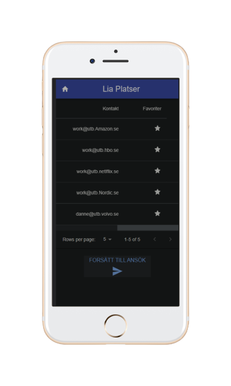
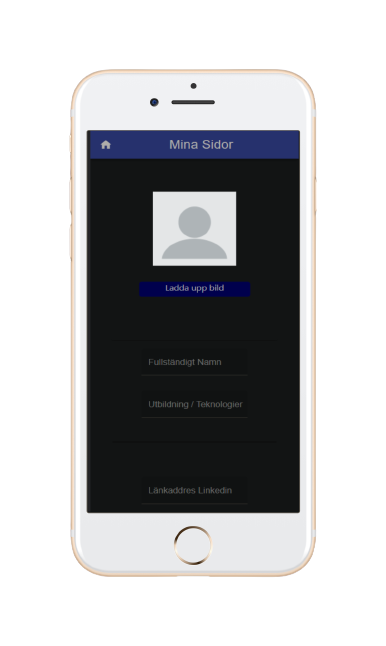

<h4 align="center" >
Student-client - LiaPlatformen
</h4>

<div align = "center">
      
  
  

</div>


##
```
Teknologier() {

Material UI: table, form, textfield buttons, contaniers mm

React Hooks: useContext, useMemo, useState mm

Typescript: interfaces, types

}
